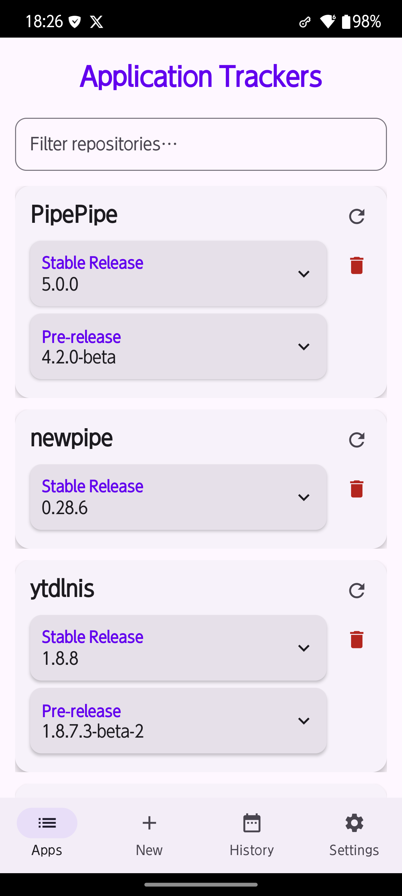
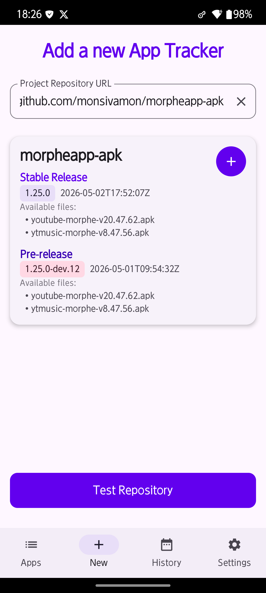
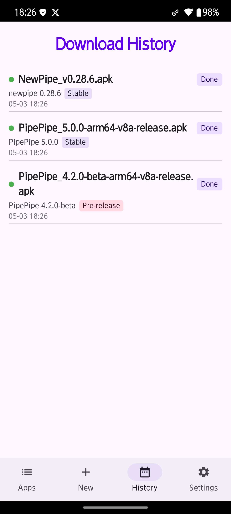
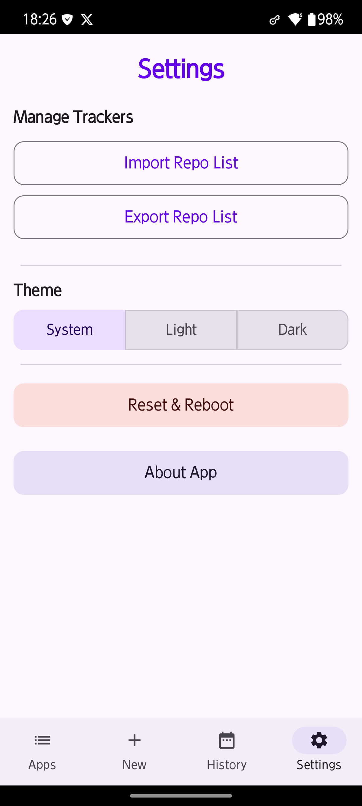

# OSS Tracker RE

A lightweight Android app that **monitors GitHub and GitLab repositories** for the latest APK releases, **downloads them in the background**, and lets you **install them with a single tap**. No browser, no file manager — everything happens right inside the app.

This project started as a fork of [jroddev/android-oss-release-tracker](https://github.com/jroddev/android-oss-release-tracker) and has since been heavily re‑designed and extended.

## 🎥 Screenshots

  
  
  
  

## ✨ Features

### 📦 Fast download engine
APKs are fetched by a dedicated foreground service. **Real‑time progress** is displayed (file name, percentage, and a progress bar). You can **pause, resume, or cancel** downloads whenever you want.

### ⚡ One‑tap install
When a download completes, a **"Tap to install"** button appears inside the repository card. Tap it, and the system package installer takes over.

### 🔍 Smart filtering
Instantly search through your tracked repositories from the Apps screen. A clear button resets the filter in one tap.

### 🌓 Theme support
Choose between **Light**, **Dark**, or **System** theme via a segmented control. Your preference is saved automatically.

### 📂 Import / Export
Back up or migrate your list of tracked repositories as a plain text file.

### 📋 Download history
The **History** tab records every download — successful or failed — with version numbers, release types (Stable / Pre‑release), and detailed error descriptions.

### 🔄 Reset function
One button erases all application data, restarts the app, and returns it to a factory‑fresh state.

## 🚀 Usage

1. **Add a repository** – Go to the **New** tab, enter a GitHub or GitLab URL, and tap **Test Repository**.
2. **Start tracking** – Tap the **+** button to add it to your list.
3. **Download** – On the **Apps** tab, tap **Download** on any asset. Progress is shown in real time — pause or resume as needed.
4. **Install** – After the download finishes, tap **Tap to install**.
5. **Manage** – Use the refresh icon to check for new releases. Import or export your list from the Settings screen.

## 🏆 Credits

- **Original project:** [jroddev/android-oss-release-tracker](https://github.com/jroddev/android-oss-release-tracker) — the foundation and inspiration for OSS Tracker RE.

## 📜 License

This project is licensed under the MIT License. See the [LICENSE](LICENSE) file for details.