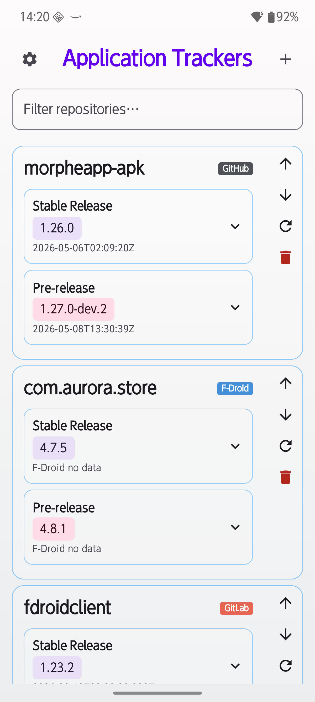
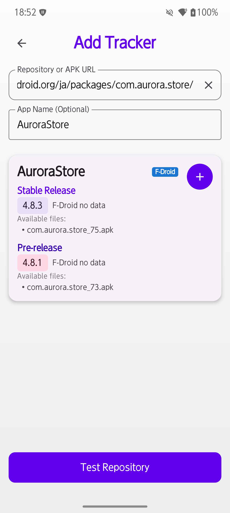
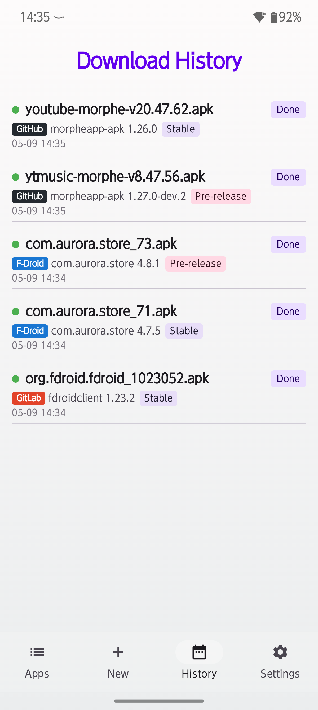
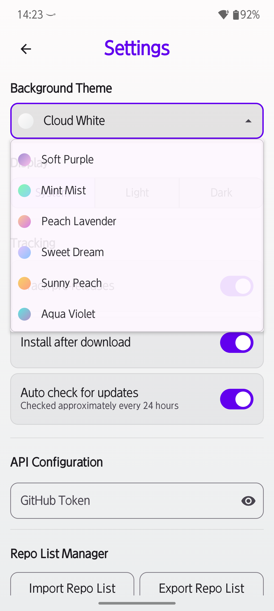
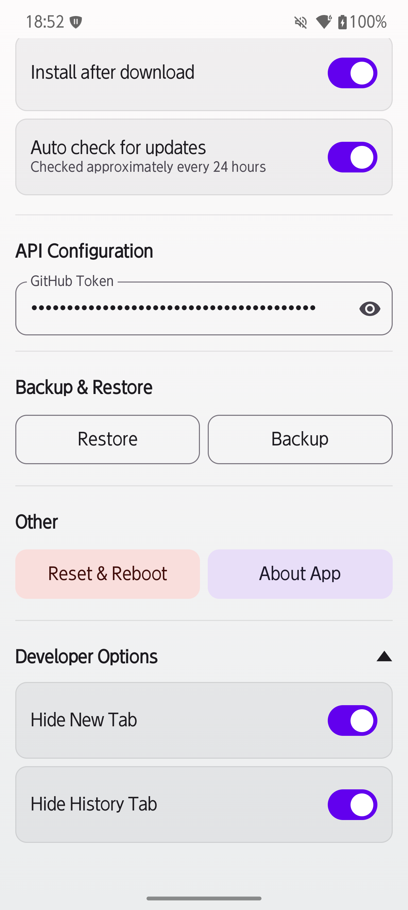

# OSS Tracker RE

A lightweight Android app that **monitors GitHub, GitLab, Codeberg, and F‑Droid repositories** (as well as **direct APK links**) for the latest APK releases, **downloads them in the background**, and lets you **install them with a single tap**. No browser, no file manager — everything happens right inside the app.

This project started as a fork of [jroddev/android-oss-release-tracker](https://github.com/jroddev/android-oss-release-tracker) and has since been heavily re‑designed and extended.

## 🎥 Screenshots

  
  
  
  
  

## ✨ Features

### 🎨 Liquid glass design
A modern frosted‑glass aesthetic with smooth blur, transparency, and refined depth gives the whole interface a clean, premium feel.

### 🎨 Custom background gradients
Choose from **16 pastel gradient palettes** in Settings to personalize the app's background. The palette is saved automatically and applies instantly.

### 📦 Fast download engine
APKs are fetched by a dedicated foreground service. **Real‑time progress** is displayed (file name, percentage, and a progress bar). You can **pause, resume, or cancel** downloads whenever you want.

### 🔗 Direct APK Link
Paste any direct APK download URL, give it a custom name, and track it just like a regular repository. Perfect for apps that don't host their releases on a supported platform.

### ✏️ Custom display names
Give every repository or APK link a friendly name — **both when adding and after tracking**. The original URL stays untouched, and the name updates instantly across the app.

### ⚡ One‑tap install — or download only
When a download completes, a **"Tap to install"** button appears inside the repository card. Prefer to install manually? Switch to **Download Only** mode in Settings — APKs land straight in your device's Downloads folder.

### 🔑 Bring your own token
GitHub limits anonymous API requests to 60 per hour. Go to **Settings → API Configuration**, paste your **Personal Access Token**, and the limit jumps to **5,000/hour**. The token is stored only on your device and never leaves it.

### 🔔 Auto update check
The app periodically checks all tracked repositories for new stable releases and notifies you when one is found. Enabled by default (every 24 hours), with a simple on/off toggle in Settings.

### ↩️ Pull‑to‑refresh
Pull down on the Apps screen to refresh all tracked repositories at once. A status indicator shows when the check is in progress.

### 🏷️ Stable & Pre‑release separated
Each repository shows its latest stable and pre‑release versions in separate, collapsible cards, complete with release dates. Toggle pre‑release tracking on or off in Settings.

### 🔍 Smart filtering
Instantly search through your tracked repositories from the Apps screen. A clear button resets the filter in one tap.

### 🌓 Theme support
Choose between **Light**, **Dark**, or **System** theme via a segmented control. Your preference is saved automatically.

### 📂 Full backup & restore
Export **everything** — repositories (with custom names and order), your GitHub token, and all app settings — into a single CSV file. Restore it later to bring back your entire setup in one shot.

### 📋 Download history
The **History** tab records every download — successful or failed — with version numbers, release types (Stable / Pre‑release), detailed error reasons, and source platform badges (GitHub / GitLab / Codeberg / F‑Droid / Direct).  
**Note:** The History tab is hidden by default. Enable it in **Settings → Developer Options** to see your download records.

### 🛠️ Developer Options
Advanced settings (such as hiding the New or History tabs from the bottom bar, or enabling the History tab itself) are tucked away in a collapsible **Developer Options** section at the bottom of the Settings screen.

### 🔄 Reset function
One button erases all application data, restarts the app, and returns it to a factory‑fresh state.

## 🚀 Usage

1. **Add a repository or direct APK link** – Tap the **+** icon on the Apps screen, enter a GitHub, GitLab, Codeberg, or F‑Droid URL (or a direct APK download link), and tap **Test Repository**.  
   - You can **optionally set a custom display name** before testing — and change it later from the card.  
   (You can re‑enable the dedicated New tab in Settings → Developer Options if you prefer.)
2. **Start tracking** – Tap the **+** icon on the preview card to add it to your list.
3. **Configure your token (recommended)** – Go to **Settings → API Configuration** and paste a GitHub Personal Access Token to avoid rate limits.
4. **Download** – On the **Apps** tab, tap **Download** on any asset. Progress is shown in real time — pause or resume as needed.
5. **Install** – After the download finishes, tap **Tap to install** (or find the APK in your Downloads folder if you're using Download Only mode).
6. **Manage** – Use the refresh icon on any card to check for new releases, or pull down on the list to refresh everything at once. Import or export your list from the Settings screen. Reorder cards with the ▲▼ arrows.

## 🏆 Credits

- **Original project:** [jroddev/android-oss-release-tracker](https://github.com/jroddev/android-oss-release-tracker) — the foundation and inspiration for OSS Tracker RE.

## 📜 License

This project is licensed under the MIT License. See the [LICENSE](LICENSE) file for details.